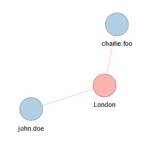
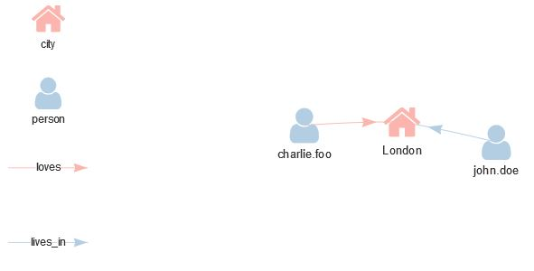

# aRangodb: an R Package to Store, Retrieve and Visualize Data with the Multi-Model Database ArangoDB

## Table of Contents
1. [ Introduction. ](#introduction)
1. [ Prerequisite. ](#prerequisite)
    * [ Setup with Docker. ](#docker)
    * [ Setup with installer. ](#installer)
1. [ ArangoDB basic concepts. ](#arangoconcepts)
1. [ Install the package. ](#installation)
1. [ Usage examples. ](#usage)
    * [ Connection to ArangoDB server. ](#connectarango)
    * [ Create or connect to a database. ](#connectdatabase)
    * [ Create or load a collection. ](#createcollection)
    * [ Insertion of documents into a collection. ](#insertcollection)
    * [ Working with documents. ](#workingdocuments)
    * [ Custom AQL queries. ](#aqlcustom)
    * [ Working with graphs. ](#workinggrapphs)
    * [ Visualize graphs. ](#visualizegrapphs)
1. [ Functions and classes summary. ](#summary)
1. [ Bugs and known limitations. ](#bugslimitations)
1. [ Roadmap. ](#roadmap)
1. [ Citation. ](#citation)


## Introduction <a name="introduction"></a>
In recent years, NoSQL technologies have seen a significant increase in their use in several software projects. This is due to the simplicity with which these technologies deal efficiently with the storage of large amounts of data which have different structures and no fixed schema. Among these technologies an important role is played by graph-oriented databases: in these systems data are stored with document-like or key-value techniques while the relationships between data are considered "first class citizens." This makes it possible to express the inherent complexity in and between data more easily than with relational databases. In addition, more complex requests can be made with simpler queries. ArangoDB is a multi-model database which allows to use both the simplicity of document-like storaging and the capacity to express relationships with graphs. As data scientists we have to face problems with growing complexities. Moreover, expressiveness of data combined with the need of management simplicity is a mandatory requirement to solve, in an efficient way, the problems we have to deal with.
Several packages that implement drivers for other graph databases have been developed, such as for Neo4J or OrientDB. However, we believe they do not create a sufficient abstraction for newbies or not skilled users.
For these reasons we developed an R package that allows data scientists and R users to get in touch with the ArangoDB technology by combining ease of use for newbies as well as more sophisticated controls for those who have already approached to ArangoDB, to AQL, and graph-oriented databases.
The aRangodb package allows the user to: manage multiple databases which are contained in a single ArangoDB instance; create collections of heterogeneous information managing them in a structured way by using R6 wrappers; filter and retrieve data from collections using functions which employ pipes; create graphs and add relationships between existing data; traverse and visualize graphs using visNetwork as a visualization engine.
Any basic operation can be done ignoring how ArangoDB works. However, for advanced users, the package offers the possibility to use the Arango Query Language (AQL, the official ArangoDB language) to define R functions which, firstly, can be invoked in the normal workflow as R functions and, secondly, can be utilized to modify, retrieve or in general interact with the connected ArangoDB instance.

Link to other projects:

* **neo4r** project: https://cran.r-project.org/web/packages/neo4r/index.html
* **orientR** project (simple connector): https://github.com/retrography/OrientR

## Prerequisite <a name="prerequisite"></a>
It is possible install ArangoDB both downloading the installer and have a stand-alone instance, or installing it by creating a Docker container using the official ArangoDB Docker image.

**IMPORTANT NOTE:** since this is still a prototype it is not yet supported the management of the users. This means that each installation you choose must disable security. This is a known limitation that will be removed when the first stable version will be released.

#### Setup with Docker <a name="docker"></a>
To setup an ArangoDB instance using Docker you can [follow those instructions](https://docs.arangodb.com/3.4/Manual/Deployment/SingleInstance/ManualStart.html#manual-start-in-docker).

#### Setup from installer <a name="installer"></a>
To setup an ArangoDB instance using the stand-alone version you can [follow those instructions](https://docs.arangodb.com/3.4/Manual/GettingStarted/Installation.html).

## ArangoDB basic concepts <a name="arangoconcepts"></a>
In order to understand the examples in the next sections it is desirable understand some basic concepts of the behaving and logic of ArangoDB. Each instance of an ArangoDB server can store multiple databases: even if you don't create any database, there is the default one named **\_system**. Every operation you invoke that is invoked with no database specified affects the **\_system** one. It is suggested to not use this database for applications.
ArangoDB is a **Multi-Model database**, this means that there are multiple ways to organize data. In particular ArangoDB is based on two main structures:

* **collections** set of documents without a fixed schema, like the structures used in MongoDb. The documents are basically set of key-value pairs (even nested) that can be represented with JSON standard;

* **graphs** where every graph you define is basically a container that group edges collections and orphan collection. In fact to define a graph the user has to indicate the definitions of the edges composing the graph, where every edge is a particular collection (an _edge collection_). The edge collections are defined between sets of _document collections_, e.g. if you have the document collections **persons, motorbikes, cars** you can define the edge DRIVE({person}, {motorbikes, cars}). Edges collections are composed by documents with the charateristic to have two special attributes "_from" and "_to" that associate the key of the document from which the edge starts to the document where the edge ends, e.g. {"_from":"persons/gabriele", "_to":"pegout"}. Edges, being documents, can also have their own attributes, e.g. {"_from":"persons/gabriele", "_to":"pegout", "since": "2016"}  

For details please refer to the official ArangoDB documentation:

* **Quick introduction** https://docs.arangodb.com/3.4/Manual/GettingStarted/DatabasesCollectionsDocuments.html
* **Core Concepts** https://docs.arangodb.com/3.4/Manual/DataModeling/
* **AQL** https://docs.arangodb.com/3.4/AQL/

## Install the package <a name="installation"></a>
To install the latest version of the aRangodb package you have to run the following commands:

```R
devtools::install_gitlab("krpack/arango-driver")
library(aRangodb)
```

Otherwise you can install a custom version using:

```R
devtools::install_git("https://gitlab.com/krpack/arango-driver.git", ref="<a_tag>")
```

available tags are {"0.0.1-alpha", "0.0.1-beta", "0.0.1-beta2", "0.0.1-beta3"}. You can also install the development version with:

```R
devtools::install_git("https://gitlab.com/krpack/arango-driver.git", branch="development")
```

## Usage examples <a name="usage"></a>
In the following sections are shown usage's examples of this package. The complete example, as R script, is located into the repository at the path "examples/arango_full_example.R".
Once installed you have to load the package:

```R
library(aRangodb)
```

### Connection to ArangoDB server <a name="connectarango"></a>
 
Connect to an ArangoDB server up and running

```R
arangoConnection <- arango_connection(<instance_ip>, <instance_port>, <username>, <password>)
```

### Create or connect to a database <a name="connectdatabase"></a>

Create a "sandbox" database: to create a database, if it is not found, use the _createOnFail_ option (default is FALSE):

```R
sandboxArangoDb <- 
  arangoConnection %>% 
  arango_database("sandbox", createOnFail = TRUE)
```

To use the default database (**DISCOURAGED**) you can do:

```R
defaultArangoDb <- 
  arangoConnection %>% 
  arango_database()
```

The object that those methods return is an instance of ArangoDatabase class and it will be used for all the operations affecting the database.

### Create or load a collection <a name="createcollection"></a>

From now on all the collections, documents and graphs will be manipulated within "sandbox" (or the db you had choosen): this means that collections, documents, and graphs will be visible and available from this DB.
Now you can create the "person" and "city" collections:

```R
persons <- sandboxArangoDb %>% arango_collection("person", createOnFail = TRUE)
cities <- sandboxArangoDb %>% arango_collection("city", createOnFail = TRUE)
```

Again it has been used the option _createOnFail_ to create the collections if they were not found into the database. The call otherwise would launch an error (collection not found).

### Insertion of documents into a collection <a name="insertcollection"></a>

Now we have two different collections: we can populate with some data for subsequent examples using the aRangodb::document_insert(key) in order to create a new document with the given key as identifier: after that we can set its values using the aRangodb::document_set() function. The insertion, and the values' updates, are consolidated in the db once invoked the aRangodb::collection_update() function. It could be a limitation, but for synchronous update support there will be a dedicated release.

```R
persons %>% 
  document_insert("john.doe") %>% 
  document_set(age=30, birthday="17/01/1989") %>% 
  collection_update()

persons %>% 
  document_insert("alice.foo") %>% 
  document_set(age=36, birthday="07/02/1983", graduated = TRUE) %>% 
  collection_update()

persons %>% 
  document_insert("brandon.fee") %>% 
  document_set(age=36, birthday="03/11/1983", jobTitle="Software Developer") %>% 
  collection_update()

persons %>% 
  document_insert("charlie.foo") %>% 
  document_set(age=34, birthday="03/02/1985") %>% 
  collection_update()

cities %>% 
  document_insert("London") %>% 
  document_set(position=list(latitude=51.5098, longitude=-2.0122), capital=TRUE, country="UK") %>% 
  collection_update()

cities %>% 
  document_insert("Manchester") %>% 
  document_set(position=list(latitude=53.4839, longitude=-2.2446), capital=FALSE, country="UK") %>% 
  collection_update()
```

You can use the collection to access some useful information about the collection itself, for example using the getCount() method.

```R
print(paste("Persons registered:", persons$getCount(), sep = " "))
```

### Working with documents <a name="workingdocuments"></a>

You can use collections to retrieve and access documents within the collection itself. For example you can get ALL the document of a collection (**BE CAREFUL**, collections could contains hundred of results) and access specific document using the key attribute. The aRango::all_documents() return a list with all the documents found for the given collection.

```R
all.cities <- cities %>% all_documents()
all.persons <- persons %>% all_documents()

if(all.cities$London$getValues()$capital){
  print("London is still the capital of UK")
} else {
  print("What's happening there???")
}
```

Each document is an object belonging to the ArangoDocument class: every instance expose the following methods:

* getKeys(), returns a vector of properties for which the document has a valid value (not null)
* getValues(), returns the list of pairs key-value for which exist a not-null mapping


Using an ArangoCollection object you can filter out documents that match some conditions. To express values
greater or less than some condition, you have to use operators %lt%, %gt%, %leq%, %geq%. Next lines will be translated as _"hey, give me all cities of UK over latitude 52.0"_

```R
filtered.cities <- cities %>% collection_filter(country="UK", position.latitude %gt% 52.0)

if(is.null(filtered.cities$Manchester)){
  print("Ehy, who moved away Manchester??") # Could be very bad
}

if(!is.null(filtered.cities$London)){
  print("Ehy, who moved away London??") # Could be very bad
}
```

You can use the aRangodb::document_set() or aRangodb::document_unset() methods to insert/update or remove an attribute from a document. For example, the following code shows an insertion, followed by an update and an unset.

```R
Lyon <- cities %>% 
  document_insert("Lyon") %>% 
  document_set(capital=FALSE, country="Fran") %>%    # wrong insertion
  collection_update()
  
Lyon %>%
  document_set(country="France") %>%                 # update
  collection_update()
  
Lyon %>%
  document_unset(capital) %>%                        # no more important
  collection_update()
```

### Custom AQL queries <a name="aqlcustom"></a>
If you are interested in custom queries you can use the native Arango Query Language (AQL). To do that
you need to specify the string containing the query using the \@variable_name to indicate bind variables: the query will be parsed to check the syntax and then converted to an R function where bind variables will be the formal parameters of the function.
Do you want to get all the persons with age more than come threshold?

```R
searchByAgeGreaterThen <- 
  sandboxArangoDb %>% 
  aql("FOR p IN person FILTER p.age > @age RETURN p")
```

The previous commands affect the current environment by adding a new function, named _searchByAgeGreaterThan_, where formal parameters are the ones corresponding to the variables left unbind in the AQL query, in this case _age_. Before returning a function, the aRango::aql() command execute the parsing of the query, so that syntax errors will be highlighted as error in the definition of the function. 
In conclusion from now on you can now execute the query as normal R function:

```R
filtered.persons <- searchByAgeGreaterThen(age = 30)
```

The results of those functions calls are returned as R list, where each result has an automatically generated id ("doc<n>") within the list.

```R
if(length(filtered.persons) != 3){
  print("Did you change something?")
}

print(paste0("'I'm Alice Foo, isn't it?' ", filtered.persons$doc0$getKey() == "alice.foo"))
```

### Working with graphs <a name="workinggrapphs"></a>
Last but not least, you can define a graph structure in the same way you can define a collection.

```R
residenceGraph <- 
  sandboxArangoDb %>% 
  arango_graph("residence", createOnFail = TRUE)
```

If you created the graph from scratch, as in this case, you can add the definitions of possible edges
that the graph can store. Adding an edge will automatically adds the collections to the graph as possible sources of edges, and it will creates a collection for the edge relation if they don't exist yet.

```R
residenceGraph <- 
  residenceGraph %>% 
  define_edge("person", "lives_in", "city")

livesInCollection <- 
  sandboxArangoDb %>% 
  arango_collection("lives_in")

if(!(is.null(livesInCollection))){
  print(paste0("'Voilà, I'm an edge collection, isn't it?' ", 
               "'",livesInCollection$getType() == collection_type$EDGE,"'"))
}
```

Also collections will be automatically created if not in the collection set:

```R
residenceGraph <- 
  residenceGraph %>% 
  define_edge(cities, "had_weather", "weather")
  
weatherCollection <- 
  sandboxArangoDb %>% 
  arango_collection("weather")

if(!(is.null(weatherCollection))){
  print(paste0("'Voilà, I'm a document collection, isn't it?' ", 
               "'",weatherCollection$getType() == collection_type$DOCUMENT,"'"))
}
```

But a graph isn't useful if you cannot populate it with relations. Just use the aRangodb::add_edges() method and the relational operators!

```R
residenceGraph <- 
  residenceGraph %>%
  add_edges("lives_in" %owns% edge(all.persons$john.doe %->% all.cities$London)) %>%
  add_edges("lives_in" %owns% edge(all.persons$brandon.fee %->% all.cities$Manchester, since="09/01/2016"))
```

You can select all the nodes and relations belonging to the graph by using the aRangodb::all_graph() function:

```R
residences.graph <- 
  residenceGraph %>%
  all_graph()
```

However in most of the cases the entire graph is not relevant for the analysis, so you may want to focus on a specific part. You can use the aRangodb::traversal() function, that implements a basic support for the AQL traversal mechanism. Starting from specific vertices of interest you can get all the edges (up to a depth you can indicate) incident on those particular vertices, called in fact start vertices. For example you may want to know all the vertices, with distance at most 2, that have an edge incident on London vertex:

```R
london.residence <- residenceGraph %>% 
  traversal(vertices = c(all.cities$London), depth = 2)
```

### Visualize graphs <a name="visualizegrapphs"></a>

A feature provided by the aRangodb package is the visualization of graphs: the underlying engine used is the visNetwork package. Once you have retrieved a graph, the whole graph or the result of some traversal, you can simply call the aRangodb::visualize() function:

```R
london.residence %>% visualize() 
```

The function result is shown in the following image:



It is also possible to have more complex visualization: you can add legend, icons (from FontAwesome 4.7), and direction of edges. For example the following command produces the graph in the next image:

```R
london.center %>% 
    viz_vertices(
        icon=list(person = "f007", city="f015")
    ) %>%
    viz_edges(
        directions = list(lives_in="to", loves="to")
    ) %>%
    viz_legend(vertices = TRUE, edges = TRUE) %>%
    visualize()
```



## Functions and Class Summary <a name="summary"></a>

Create a connection with an ArangoDB instance.

```R
ArangoConnection <- aRango::arango_connection(server, port)
```

Returns a list with the name of all the available databases for this ArangoDB instance

```R
character_vector <- ArangoConnection %>% aRango::databases()
```

Return an object representing the database with the given name, create a database with the given name (if not exist), or the default database.

```R
ArangoDatabase <- ArangoConnection %>% aRango::arango_database(name)
ArangoDatabase <- ArangoConnection %>% aRango::arango_database(name, createOnFail=TRUE)
ArangoDatabase <- ArangoConnection %>% aRango::arango_database()
```

The given database is deleted from the server.

```R
bool <- ArangoDatabase %>% aRango::drop()
```

Returns a list with all the available collections for the given database

```R
character_vector <- ArangoDatabase %>% aRango::collections()
```

Return an object representing the collection with the given name or create a collection with the given name (if not exist).

```R
ArangoCollection <- ArangoDatabase %>% aRango::arango_collection(name, createOnFail=FALSE)
ArangoCollection <- ArangoDatabase %>% aRango::arango_collection(name)
```

The given collection is deleted from the server.

```R
bool <- collection %>% aRango::drop()
```

Returns a list with all the documents belonging to the given collection

```R
list<ArangoDocument> <- ArangoCollection %>% aRango::all_documents()
```

Returns a list with all the documents belonging to the given collection

```R
list<ArangoDocument> <- ArangoCollection %>% aRango::all_documents()
```
Methods for document management: insert a new document, with custom key, set the attributes of the document, remove the mapping for the given keys, delete a document and execute the pending modifies to a document.

```R
ArangoDocument <- ArangoCollection %>% aRango::document_insert(key)
ArangoDocument <- ArangoDocument %>% aRango::document_set(...)
ArangoDocument <- ArangoDocument %>% aRango::document_unset(...)
ArangoDocument <- ArangoDocument %>% aRango::delete()
ArangoDocument <- ArangoDocument %>% aRango::collection_update()
```

Returns the documents that matches the given filters. The filters passed as parameters are converted in strings that will be added in the query. So assigments are converted into equality filter, a=1 in "a==1", for **comparison operators you MUST USE** the following operators:  

* id %lt% expr: "id < value"
* id %leq% expr: "id <= value"
* id %gt% expr : "id > value"
* id %geq% expr : "id >= value"

```R
character <- id %lt% expr
character <- id %leq% expr
character <- id %gt% expr
character <- id %geq% expr
list<ArangoDocument> <- ArangoCollection %>% aRango::collection_filter(...)
```

Returns a list with all the available graphs for the given database

```R
character_vector <- ArangoDatabase %>% aRango::graphs()
```

Returns a list with all the available graphs for the given database

```R
ArangoGraph <- ArangoDatabase %>% aRango::arango_graph(name, createOnFail=FALSE)
ArangoGraph <- ArangoDatabase %>% aRango::arango_graph(name)
```

Adds a definition of a new edge for the given graph

```R
ArangoGraph <- ArangoGraph %>% aRangodb::define_edge(fromCollection, relation, toCollection)
```

Adds and removes of edge. Input of the folloqing functions are list of list, where each inner list contains the information
representing the edge: e.g. list(list(collection="friends", edge=list(`_from`="person/bob", `_to`="person/alice", ...))...)

```R
ArangoGraph <- ArangoGraph %>% add_edges(...)      # takes a list of list representing edges definitions
ArangoGraph <- ArangoGraph %>% remove_edges(...) # takes a list of list representing edges definitions
```

To simplify the process of addition/removal of edges you can use the relationa operators for inbound edges %<-% or outbound edges %->%, aRangodb::edge() function and the %owns% relation.

```R
list <- ArangoDocument %->% ArangoDocument            # returns a list(`_from`=..., `_to`=...) 
list <- character %owns% edge(list, ...)                # returns a list containing the from/to information, the collection name representing the edge and the values (if any) for this edge
```

The previous functions work as:

```R
doc1 %->% doc2  # returns a list(`_from`=doc1$getId(), `_to`=doc1$getId())
```

```R
edge(doc1 %->% doc2, ...)   # where the variadic part can be assignments representing values of the edge. This call returns list(`_from`=doc1$getId(), `_to`=doc1$getId(), aKey=1)
```

```R
character %owns% edge(doc1 %->% doc2)   # returns list(list(collection=character, edge=list(`_from`=doc1$getId(), `_to`=doc1$getId())))
```

Find an existing edge, where the ArangoCollection represents a collection_type$EDGE:

```R
ArangoDocument <- ArangoCollection %>% find_edge(from=<ArangoDocument>, to=<ArangoDocument>)
```

Retrieve the entire graph structure:

```R
ArangoGraphConcrete <- ArangoGraph %>% all_graph()
```

Executing the traversal of a graph:

```R
ArangoGraphConcrete <- ArangoGraph %>% traversal(vertices=c(<ArangoDocuments>), depth=<int>)
```

Visualize the graph:

```R
ArangoGraphConcrete %>%
  viz_height("500px") %>%
  viz_width("500px") %>%
  viz_vertices(icon = list(<collection_name>=<unicode_icon_fa_4.7.0>, ...), colors = list(<collection_name>=<color>)) %>%
  viz_edges(directions = list(<edge_name>=<"to" or "from">,...)) %>%
  viz_legend(vertices = <bool>, edges = <bool>) %>%
  visualize()
```

The following functions are the ones for users management. Retrieve all the users registered to the connected instance:

```R
ArangoConnection %>% users()
```

Adding, editing, removing a user.

```R
ArangoConnection %>% add_user(username, password)
ArangoConnection %>% edit_user(username, password)
ArangoConnection %>% remove_user(username)
```

Retrieve the level access of a user for a resource (database/collection). The results are the one given by the ArangoDB instance:

* "rw" read/write, correspond to the ADMIN level
* "ro" read, correspond to the ACCESS level
* "none" correspond to the NO ACCESS level

```R
ArangoConnection %>% user_access_level_database(user, database)
ArangoConnection %>% user_access_level_collection(user, database, collection)
```

To set the level access of a user for a resource (database/collection). It is possible to use the grant as string ("rw", "ro", "none") or the corresponding enumeration (resource_access\$ADMIN, resource_access\$ACCESS, resource_access\$NO_ACCESS):

```R
ArangoConnection %>% set_user_access_level_database(user, database, grant)
ArangoConnection %>% set_user_access_level_collection(user, database, collection, grant)
```

## Bugs and Knonw Limitations <a name="bugslimitations"></a>
The following is an uncomplete list of known limitations to be addressed in the next versions:

* **partial graph traversal**, it is not natively provided by the aRangodb::traversal() function the possibility to filter some vertex, edge or path using the FILTER AQL clause. In order to do that you have to define a custom aRangodb::aql() function, but this will not return you a graph: this because aql() returns generic results from the server.

## Roadmap <a name="roadmap"></a>
The following is an uncomplete frequently-updated list to recap the major features in plan for the next versions.

* Version **0.0.1-beta**:
    * User management functions

* Version **0.0.1**:
    * First release of the package

* Version **0.1.0**:
    * first stable release with major bug fixing 
    * complete unit tests coverage

* Version **0.2.0**:
    * bulk insertion of JSON files
    * bulk insertion of CSV files
    * bulk export of graphs/collection in JSON files
    * bulk export of graphs/collection in CSV files
    
* Version **0.3.0**:
    * support for basic algorithms on graphs
    
* ...

## Citation <a name="citation"></a>
To cite aRangodb in publications use:

  Gabriele Galatolo, Ilaria Ceppa, Matteo Papi, Francesca Giorgolo, Davide Massidda, Marco Calderisi (2019). aRangodb: an R Package to Store, Retrieve and Visualize Data with the Multi-Model Database ArangoDB.

A BibTeX entry for LaTeX users is

@Manual{
  title = {aRangodb: an R Package to Store, Retrieve and Visualize Data with the Multi-Model Database ArangoDB},
  author = {Gabriele Galatolo, Ilaria Ceppa, Matteo Papi, Francesca Giorgolo, Davide Massidda, Marco Calderisi},
  organization = {Kode Srl},
  address = {Pisa, Italia},
  year = {2019},
  url = {www.kode-solutions.net}
}